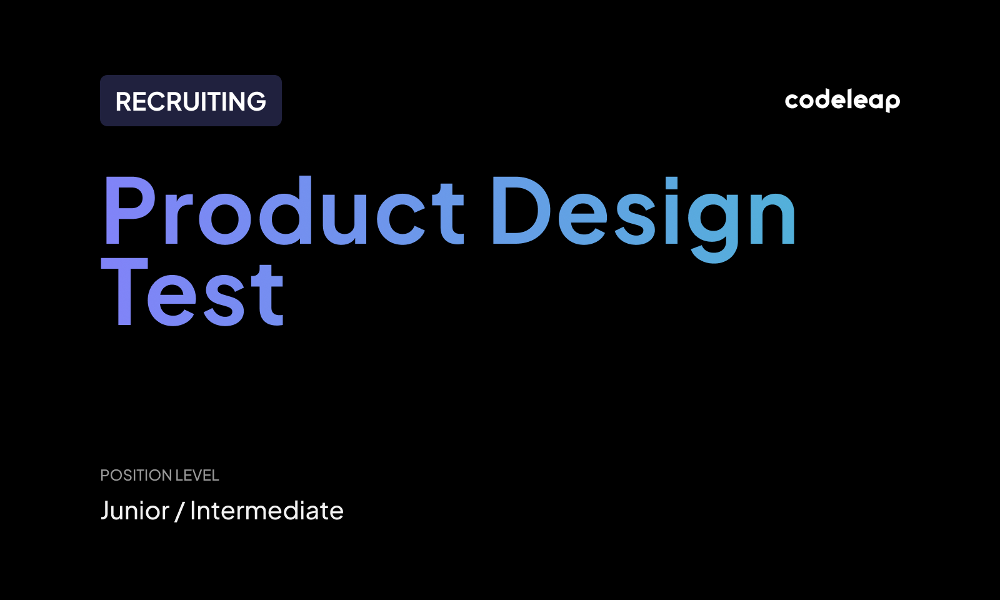

# CodeLeap Product Design Test

<p align="center">
  
</p>

## 🖥️ Project

Project developed as a technical test for a Product Design/Frontend position at CodeLeap. The goal is to create an interface for a simple application similar to a social media that will perform just basic CRUD functions.


## 🚀 Technologies

The following technologies were used to develop this project:
- Vite + React
- TailwindCSS  
- TypeScript
- React Router

## 🛠️ Installation

Use the package manager [npm](https://www.npmjs.com/) or [pnpm](https://pnpm.io/pt/) to install the project dependencies.

## 🐾 Steps
First download or clone the project folder from this GitHub repository. 

Then run the command to install the dependencies:
```bash
npm install
pnpm install
```

Lastly run the command to run the frontend application on your localhost:
```bash
npm run dev
pnpm run dev
```

### ✨ You also can check the project running [here](https://codeleap-test-five.vercel.app/)!